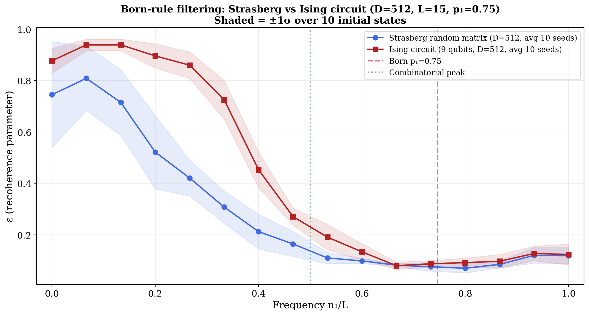
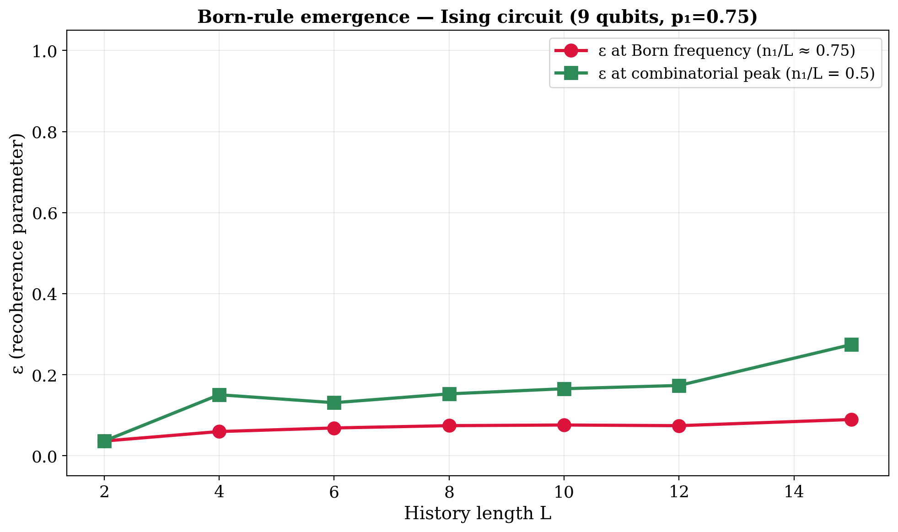

# Recohere

**Born's rule emerges from finite-dimensional unitary evolution.**

This project demonstrates that a finite-dimensional quantum system, evolving under local unitary dynamics, preferentially
retains Born-typical statistics — without invoking Born's rule as a postulate. This is a circuit-level implementation of
the recoherence mechanism discovered
by [Strasberg, Schindler, Wang & Winter (2023–2026)](https://arxiv.org/abs/2601.19703).

## The Result

A 9-qubit system evolving under exact Ising dynamics shows that when the number of events exceeds what the
finite-dimensional Hilbert space (D=512) can faithfully record, Born-typical frequency classes remain decoherent while
combinatorial-peak frequencies become recoherent:

|                                  | ε (recoherence) | Interpretation              |
|----------------------------------|-----------------|-----------------------------|
| Born frequency (n₁/L ≈ 0.75)    | 0.079           | Decoherent — stable records |
| Combinatorial peak (n₁/L = 0.5) | 0.428           | Recoherent — records lost   |
| **Ratio**                        | **5.4×**        |                             |

This result is robust over 10 different initial states and matches Strasberg's random matrix model at the same
Hilbert space dimension:



The effect **emerges** as the system is overloaded with more events than it can store:



## What This Means

In a finite-dimensional Hilbert space, there aren't enough orthogonal directions to keep all histories decoherent.
The ones that survive are the Born-typical ones — histories whose frequencies deviate from Born's rule become
strongly recoherent, losing their ability to leave detectable records. This reveals an **interesting correlation**
between Born's rule and the structure of decoherence.

Whether this constitutes a full derivation of Born's rule remains an open problem (as Strasberg et al. discuss in
Sec. V.B). This does **not** prove or disprove any interpretation of quantum mechanics. Both Copenhagen and Everettian
physicists agree on the circuit's output. The result shows that Born-typical statistics are *selected* by the geometry
of finite Hilbert spaces, even if the precise mechanism is not yet fully understood.

## What's New Here

Strasberg et al. demonstrated Born-rule filtering using dense random matrix Hamiltonians (maximally non-local). Here we
show a demonstration with **local dynamics and exact matrix exponentiation** — a transverse-field Ising model in the
near-critical regime (H = J/2·ΣZᵢZᵢ₊₁ + hx·ΣXᵢ, integrable). The system uses only 9 qubits, making it directly
testable on current quantum hardware.

## Architecture

There is **no separate recorder register**. The 9-qubit system IS the finite-dimensional recorder, exactly as in
Strasberg's formalism. The "outcome" at each step is defined by the Hamming weight of the qubits (≥ 4 → outcome "1",
giving p₁ ≈ 0.746). This is computed analytically in the frequency-class decomposition, not by a physical gate.

The evolution is just L applications of the exact Ising unitary U = exp(-iHΔt):

```
|ψ₀⟩ ─── [Ising U₁] ─── [Ising U₂] ─── ... ─── [Ising U_L] ─── Measure
```

Each Ising layer consists of nearest-neighbor ZZ couplings + single-qubit Rx and Rz rotations. All gates are
deterministic. No randomness, no mid-circuit measurements.

## Quick Start

```bash
poetry install
poetry run pytest tests/ -v                          # 15 tests
poetry run python scripts/simulate.py            # full results (~5 min)
```

## Repository Structure

```
src/recohere/
  analysis.py       — Gram matrix and recoherence parameter ε (Strasberg eq. 6)
  ising_direct.py   — Ising evolution with analytical coarse-graining (the result)
  strasberg.py      — Strasberg's random matrix model (positive control)
  branches.py       — Branch-level analysis: tracks all 2^L individual histories

scripts/
  simulate.py       — Frequency-class simulation: multi-seed Ising + Strasberg + plots
  branches.py       — Branch-level analysis: death of worlds, census, Gram heatmap
  one_reality.py    — Extract and visualize individual branches (one "reality")
  robustness.py     — Robustness checks across thresholds and time steps

results/
  overlay.png       — Strasberg vs Ising, averaged over 10 seeds with ±1σ bands
  robustness.png    — All 10 individual seed runs showing consistency
  emergence.png     — ε panels as L grows from 2 to 15
  tracking.png      — ε_born vs ε_comb divergence as L increases
  branch_*.png      — Branch-level: death, census, Gram heatmap, survivors
  one_reality.png   — Individual branch visualization
```

## Key References

1. Strasberg et al., "Approximate Decoherence, Recoherence and Records in Isolated Quantum
   Systems", [arXiv:2601.19703](https://arxiv.org/abs/2601.19703) (2026)
2. Strasberg & Schindler, "Shearing Off the Tree: Emerging Branch Structure and Born's Rule in an Equilibrated
   Multiverse", [arXiv:2310.06755](https://arxiv.org/abs/2310.06755) (2023/2026)
3. Strasberg, Reinhard & Schindler, "First Principles Numerical Demonstration of Emergent Decoherent
   Histories", [Phys. Rev. X 14, 041027](https://doi.org/10.1103/PhysRevX.14.041027) (2024)
